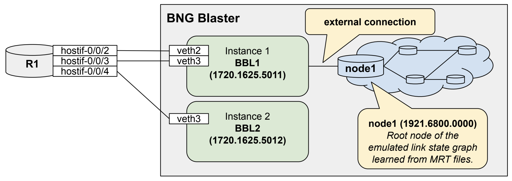

03. Routing
===========

This section explores routing protocols, including BGP, ISIS, and more, 
helping participants understand how to test routing protocols, scaling, 
and convergence to evaluate network performance and stability.

https://rtbrick.github.io/bngblaster/routing/index.html

The following image illustrates the emulated network topology, 
which applies to all routing tests in this training.

03.01. ISIS
-----------

This test is about ISIS with segment routing enabled.

https://rtbrick.github.io/bngblaster/routing/isis.html

.. code-block:: none

    # > Linux
    cd ~/bngblaster-training/03_routing/01_isis

    # Generate ISIS Topology
    lspgen -h
    lspgen --level 2 --area 49.0001/24 --connector 1720.1625.5011 -m isis.mrt

    # Start BNG Blaster
    bngblaster -S run.sock -C config.json -l isis

In the other shell, use the following commands to interact 
with the active BNG Blaster instance.

.. code-block:: none

    # > Linux
    cd ~/bngblaster-training/03_routing/01_isis
    bngblaster-cli run.sock isis-adjacencies

.. code-block:: none

    # > RBFS (op)
    show show isis neighbor
    show isis database
    show route
    show route summary

    # ping one of the nodes in the emualted ISIS network
    ping 192.168.0.0 source-ip 172.16.255.1

Checking the Grafana dashboard, you should see an increase in the route count.

Now you can play with the size of the emulated ISIS topology by increasing node count (``-c``) 
or amount of external routes (``-e``), where external routes are automatically equally distributed 
over all nodes. Meaning 1000 nodes with 1000 external routes results into one external route per node. 

.. code-block:: none

    # > Linux
    lspgen --level 2 --area 49.0001/24 --connector 1720.1600.0011 -m isis.mrt -c 1000 -e 1000

Now you can start the BNG Blaster again and verify the ISIS database, routes, and the Grafana dashboard.

03.02. OSPF
-----------

This test is about OSPFv2 and OSPFv3.

https://rtbrick.github.io/bngblaster/routing/ospf.html

.. code-block:: none

    # > Linux
    cd ~/bngblaster-training/03_routing/02_ospf

    # Generate OSPF Topology
    lspgen -h
    lspgen -y --protocol ospf2 --connector 172.16.255.11:172.17.0.1 -m ospf2.mrt
    lspgen -y --protocol ospf3 --connector 172.16.255.11:172.17.0.1 -m ospf3.mrt

    # Start BNG Blaster
    bngblaster -S run.sock -C config.json -l ospf

In the other shell, use the following commands to interact 
with the active BNG Blaster instance.

.. code-block:: none

    # > Linux
    cd ~/bngblaster-training/03_routing/02_ospf

    bngblaster-cli run.sock ospf-neighbors instance 1
    bngblaster-cli run.sock ospf-neighbors instance 2
    bngblaster-cli run.sock ospf-neighbors instance 3
    bngblaster-cli run.sock ospf-neighbors instance 4

.. code-block:: none

    # > RBFS (op)
    show ospf neighbor
    show ospf database
    show route
    show route summary

    # ping one of the nodes in the emualted OSPF network
    ping 192.168.0.0 source-ip 172.16.255.1

03.03. LDP
----------

This test is about LDP.

https://rtbrick.github.io/bngblaster/routing/ldp.html

.. code-block:: none

    # > Linux
    cd ~/bngblaster-training/03_routing/03_ldp

    # Generate ISIS Topology and LDP label mappings
    lspgen -y --level 2 --area 49.0001/24 --connector 1720.1625.5011 -e 10 -m isis.mrt
    ldpupdate -l 172.16.255.11 -p 192.168.0.0/32 -P 10 -M 10 -f update.ldp

    # Start BNG Blaster
    bngblaster -S run.sock -C config.json -l ldp

Execute the following commands within the RBFS CLI:

.. code-block:: none

    # > RBFS (op)
    show ldp neighbor
    show ldp session
    show ldp tcp connection detail
    show ldp route

In the other shell, use the following commands to interact 
with the active BNG Blaster instance.

.. code-block:: none

    # > Linux
    cd ~/bngblaster-training/03_routing/03_ldp

    bngblaster-cli run.sock ldp-sessions
    bngblaster-cli run.sock ldp-database ldp-instance-id 1
    bngblaster-cli run.sock ldp-database ldp-instance-id 2

.. code-block:: none

    # > Linux
    cd ~/bngblaster-training/03_routing/03_ldp

    bngblaster-cli run.sock stream-info flow-id 1
    bngblaster-cli run.sock stream-info flow-id 2

The BNG Blaster monitors each traffic flow, tracking up to two receive labels 
along with the received EXP and TTL values. Use ``jq`` to check if the received 
labels match with those advertised via LDP:

.. code-block:: none

    # > Linux
    cd ~/bngblaster-training/03_routing/03_ldp
    bngblaster-cli run.sock stream-info flow-id 1 | jq .'["stream-info"]["rx-mpls1"]'
    bngblaster-cli run.sock stream-info flow-id 2 | jq .'["stream-info"]["rx-mpls1"]'

03.04. BGP
----------

https://rtbrick.github.io/bngblaster/routing/bgp.html

.. code-block:: none

    # > Linux
    cd ~/bngblaster-training/03_routing/04_bgp

    # Generate BGP updates with corresponding streams
    bgpupdate -f update.bgp -a 65001 -l 100 -n 172.16.2.2 -N 1 -p 10.1.0.0/24 -P 100000 --end-of-rib -s streams.json --stream-interface veth4:10 --stream-pps 0.1

    # Start BNG Blaster
    bngblaster -S run.sock -C config.json -T streams.json -l bgp -I

.. note::

    The configuration shows asymmetric thread allocation, with two TX threads for the traffic source interface 
    and two RX threads for the traffic destination interface. All other interfaces and traffic directions are 
    handled by the main thread.

In the other shell, use the following commands to interact 
with the active BNG Blaster instance.

.. code-block:: none

    # > Linux
    cd ~/bngblaster-training/03_routing/04_bgp
    bngblaster-cli run.sock bgp-sessions

.. code-block:: none

    # > RBFS (op)
    show route summary
    show bgp peer 
    show bgp tcp bgp.iod.1 connection detail

03.05. BGP with ISIS
--------------------

This test simulates a BGP session initiated from an address that is reachable exclusively through 
the IS-IS network, advertising prefixes with next-hops distributed across the virtual IS-IS topology.

.. code-block:: none

    # > Linux
    cd ~/bngblaster-training/03_routing/05_bgp_isis

    # Generate ISIS Topology, BGP updates and streams
    lspgen --level 2 --area 49.0001/24 --connector 1720.1625.5011 -m isis.mrt -c 100
    bgpupdate -f update.bgp -a 65001 -l 100 -n 192.168.0.0 -N 100 -p 10.1.0.0/24 -P 10000 -s streams.json --stream-interface veth4:10
    bgpupdate -f update.bgp -a 65001 -l 100 -n 192.168.0.0 -N 100 -p fc66:1::/48 -P 10000 --append --end-of-rib -s streams.json --stream-interface veth4:10 --stream-append

    # Start BNG Blaster
    bngblaster -S run.sock -C config.json -T streams.json -l isis -l bgp -I 

.. code-block:: none

    # > Linux
    cd ~/bngblaster-training/03_routing/05_bgp_isis
    bngblaster-cli run.sock stream-info flow-id 1

As an optional task, you can stop the BNG Blaster and make the following configuration change.

.. code-block:: none

    # > RBFS (op)
    switch-mode config
    # > RBFS (cfg)
    set instance default protocol bgp address-family ipv4 unicast resolve-nexthop safi labeled-unicast
    commit switch-to-op

Restart the BNG Blaster and review the ``stream-info`` details to see if any changes have occurred. 

.. code-block:: none

    # > Linux
    # Start BNG Blaster
    bngblaster -S run.sock -C config.json -T streams.json -l isis -l bgp -I 

Now review the ``stream-info`` output and look for ``rx-mpls1``.

.. code-block:: none

    # > Linux
    cd ~/bngblaster-training/03_routing/05_bgp_isis
    bngblaster-cli run.sock stream-info flow-id 1

Finally, revert the configuration to its original state.

.. code-block:: none

    # > RBFS (op)
    switch-mode config
    # > RBFS (cfg)
    rollback 1
    show diff set
    commit switch-to-op

03.06. BGP Convergence
----------------------

This script is an adapted version of the BGP CP/DP Testing script 
from the project below, tailored to run on low-scale virtual resources.

https://github.com/rtbrick/BGP-CP-DP-Testing

This project demonstrates how to measure the convergence between the BGP Control-Plane (CP) 
and the Data-Plane (DP) using the open-source tool BNG Blaster. By utilizing BNG Blaster, 
we can analyze and monitor the time it takes for routing changes to propagate from the control-plane, 
where BGP updates occur, to the data-plane, where actual data packet forwarding happens.

.. code-block:: none

    # > Linux
    cd ~/bngblaster-training/03_routing/06_bgp_convergence

    # Generate BGP updates and streams
    ./generate_routes.sh

    # Start test
    ./convergence.py

.. note::
    
    You can use the ``./stop.sh`` script to manually force-stop the test.